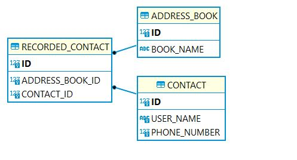

# wrkr

## Approach

#### Overall Basic Requirements (assumptions)
These should be hopefully obtained easily by reading the code, but I'll just lay out my thoughts
on the Address Book app.

- One central address book that can have contacts saved to it. The backend code is setup to allow multiple address book interactions, but everything is defaulted to use the first address book for crud operations.
  - However, there is a second demo address book present to accomplish part 3 of the challenge
- A contact is a name and a number that is less than 8 digits
- Two contacts can share the same name
- Two contacts cannot share the same name and same number
- A contact can be in multiple address books


#### Database schema
So I went with a simple schema. Two tables to describe a contact and the address books. Then a manyToMany central recorded_contact table to describe the relationship between the two. 

Every time a brand new contact is added, it is first saved into the contacts table and then tied to an address book via the recorded_contact table.
Pre-exisitng contacts can then be tied to multiple address books. This relationship is to achieve part 3 of the coding challenge .



### App architecture
It is a layered Spring MVC web app consisting of a Client -> Controllers -> Service -> Data layer

- All persistence is based off CrudRepository's ... Spring JPA
- All Controllers return a html path to a template ... Spring MVC
- Services manage business logic
- The client is a very very simple vanilla JS based view
  - I dont have enterprise exp with a well known JS framework, so I decided to keep this super simple and to just achieve the requirements set out. Simple form validation is in place.

On the use of Spring MVC. It is intended to be a multipage app but as you will see I just redirect back to "/" mostly. This is for simplicity of the app and Spring MVC isnt being used to its potential. 
I left it in to show I know how to use it, and also I wanted to stay away from an AJAX cleint as I wanted to spend most of my time in the backend. Instead of writing callback methods in the frontend with AJAX.

My overall feelings on the fronted where, if I wasnt using a framework I wanted to keep it to a bare minimum. Vanilla JS can be hard to maintain plus understand.

#### DB
I am using an Embedded H2 database. I am doing so as my interpretation of "between successive runs of the program", from the Coding Challenge PDF, meant the app needed to be persisted. 
Normally I would use PostgreSQL, but it was a bit heavyweight for this app. I didnt want to get into containerisation or vagrant for setting it up as I didnt think it was necessary. So I went with H2. 
It's my first time using it so there are a few gotchas.
- I was losing time getting it running in server mode with Spring JPA so I have left it in basic embedded mode but it does persist over successive runs. Through the use of a local file under ~/h2-databases.
- This means, you can only connect to it while the app is off. And vice versa. If you get a "The file is locked" exception. This means either the db client is still connected or the app is connected while trying to use the db client.
- To view the db, use the downloaded H2 [client](https://www.h2database.com/html/main.html) to connect for easiest startup. Connection details can be found in [application.yml](.src/main/resources/application.yml)

#### Testing
There are a number of Unit tests included. A mockMvc tests for the controller and then one for each of the services. If I had more time I would have included an integration test that would bring up the db and test everything end to end.
Hopefully, what I have included is enough to show my knowledge around TDD.

### How to run
#### Prerequisites
Java 8

#### Running
It is a gradle Java 8 Spring Boot application so there are a few different ways of running it. The simplest way is 
```shell script
./gradlew bootrun
```

To run the tests

```shell script
./gradlew test
```

### Tech stack dependencies

Here a quick list of some interesting libs I have used for this demo:

- [Mockito](https://site.mockito.org/): In order to mock components easily
- [Lombok](https://projectlombok.org/): It provides an easy way to create Builder patterns, and also reduces code
- [Thymeleaf](https://www.thymeleaf.org/): Template engine for accessing the model in the view templates
- [H2](https://www.h2database.com/html/main.html): In memory database for this little demo
- [Flyway](https://flywaydb.org/): A db migration tool. Helped with the initialisation of db

### Self Criticism
- Lack of frontend testing
  - If I had have used a framework I could have used something like [Jest](https://jestjs.io/)
  - Even without, with more time, could have added Selenium testing or used [JSoup](https://jsoup.org/) to verify the html coming back in the mockMvc tests.
- I didn't create Interfaces for the services and then implement them
- Needs more integration tests (testing of the different layers working together)
- Strict functionality. Can only save to one address book. But I believe given the scope this is acceptable
- The frontend lacks a lot of polish. However, I wanted to spend my time showcasing my backend skills as I made a decision for the fronted to be purely functional but still get across I know how clients should work and be developed.
- Lack of UX polish


Overall, I hope the way I have coded this small demo shows I know the core principles of web application development. Some aspects may be simple (phone number validation) but are there to show I know when and where to do such things. 

